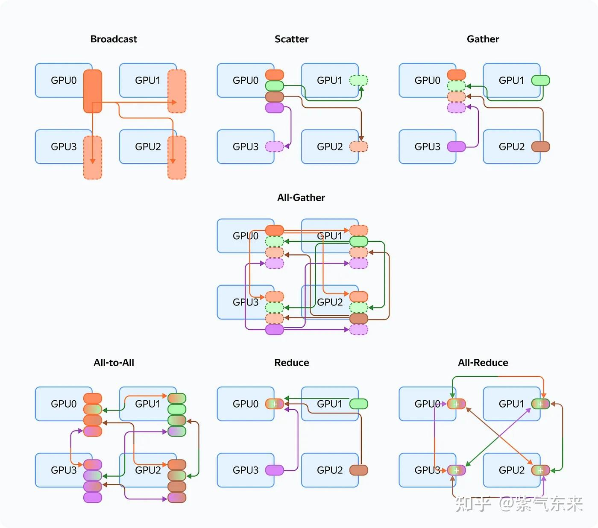
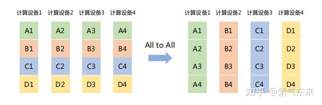
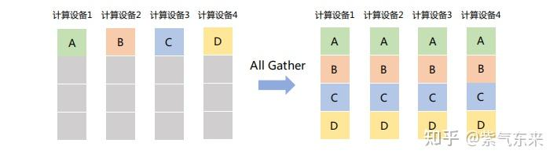
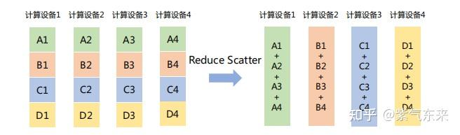
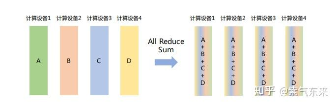
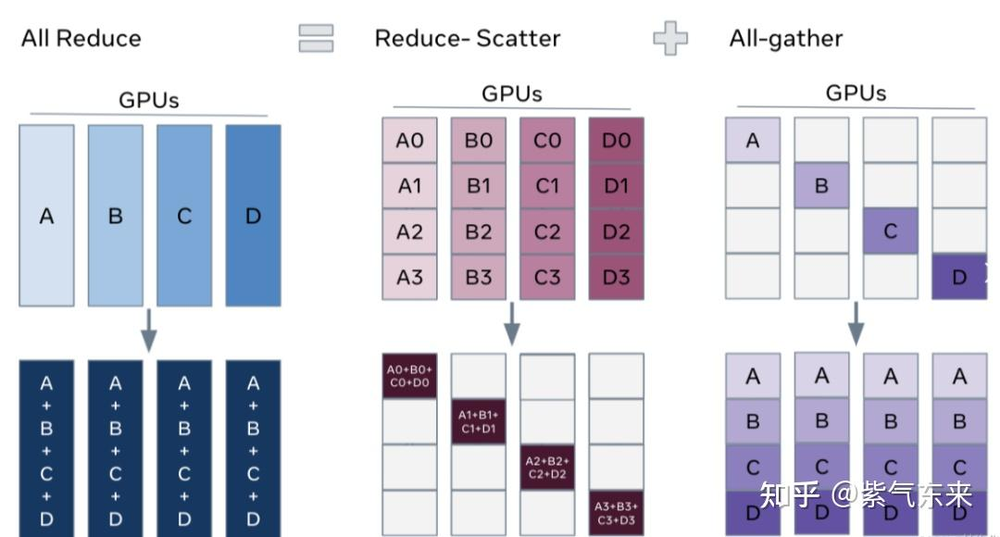
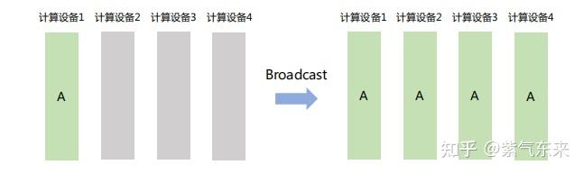
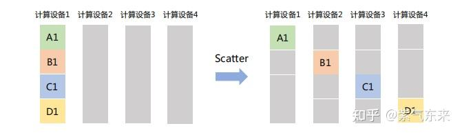

链接：[(99+ 封私信 / 80 条消息) sys(2): 通信原语及其性能分析 - 知乎](https://zhuanlan.zhihu.com/p/706135598)

在分布式计算中，最关键的部分之一就是通信。其中最关键的通信原语包括 reduce,all reduce,scatter,gather,all gather,broadcast和 all-to-all；

分布式训练通常在计算集群上进行，集群的每个节点分别执行一部分计算。不同节点的计算之间有数据依赖和共享，需要将数据在不同节点间传输，这就是通信。分布式的通信一般有两大类：
1、 集合通信（Collective communication，CC）：在一组节点内进行通信
2、点对点通信（Point to point communication，P2P）：在两个节点之间进行通信

MPI 和 NCCL 是最常用的通讯库，MPI专注于CPU的并行通讯，NCCL则专注于GPU的通讯。

**Message Passing Interface (MPI)**

* MPI 信息传递接口，是一个用于编写并行计算程序的编程接口。它提供了丰富全面的通信功能。
* MPI 常用于在计算集群、超算上编写程序，比如很多传统科学计算的并行程序。MPI 接口的兼容性好，通信功能丰富，在深度学习框架中主要用于 CPU 数据的通信。
* MPI是一个开放接口，有多种实现的库，一种广泛使用的开源实现是 Open MPI。一些硬件厂商也提供针对硬件优化的实现。

**NVIDIA Collective Communication Library (NCCL)**

* NCCL 英伟达集合通信库，是一个专用于多个 GPU 乃至多个节点间通信的实现。它专为英伟达的计算卡和网络优化，能带来更低的延迟和更高的带宽。
* NCCL 也提供了较丰富的通信功能，接口形式上与 MPI 相似，可满足大多数深度学习任务的通信需求。它在深度学习框架中专用于 GPU 数据的通信。因为NCCL则是NVIDIA基于自身硬件定制的，能做到更有针对性且更方便优化，故在英伟达硬件上，NCCL的效果往往比其它的通信库更好。

